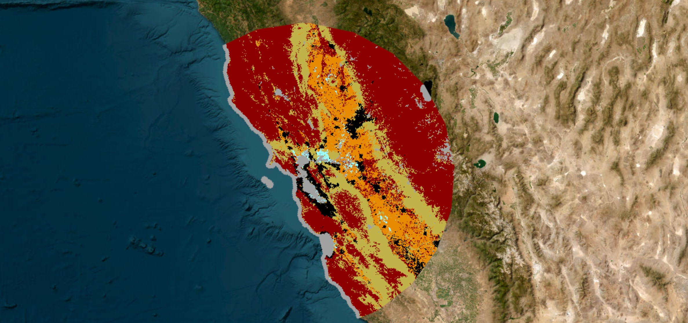

# Relatable Impact!

Watch [this](https://youtu.be/UT_-BeZl2o4) `5min` YouTube video for the premise of the project.
[](https://www.youtube.com/watch?v=UT_-BeZl2o4)

---

# Case Studies

I hope you found the video helpful. It can seem daunting to visualize so many datapoints, or to even find the landcover for your required population count. I went an extra mile, and created two libraries which you can call to __optimally__ find desired `region-of-interest`.

The added advantage of using this library is that you can play around with the widget in your jupyter notebook, all you have to do is grant Google Earth Engine permissions to your google cloud platform so that it can render your desired results.

## SPACE

What if the Australian BushFires of 2019-20 happened in NYC.

```python

```


Extra MILE: Showing the number of trees the [Team Trees](https://teamtrees.org/) planted.

```python

```


## TIME

What if the Spanish Plague reappeared.

```python

```


## REALITY

What if Genghis Khan sailed to US instead of Columbus.

```python

```


## GOOD STUFF

```python

```


---

# Credits

All the data are as latest as possible. The population data was released on Jul 2023, corresponding to 2022 closing populations.
